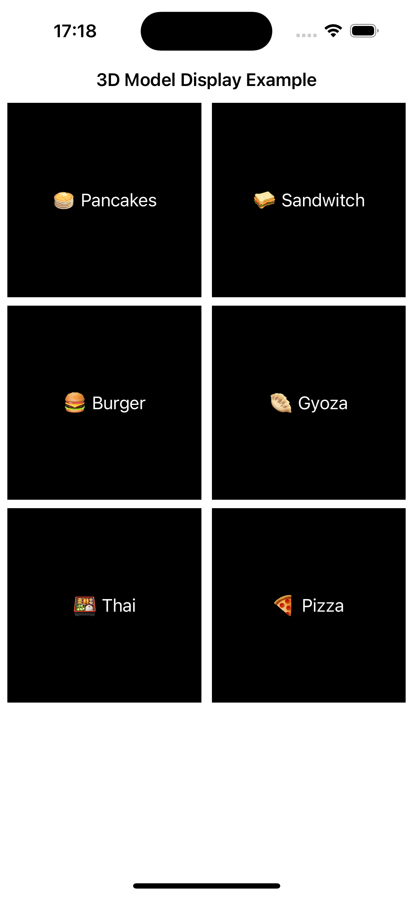

[ING] - AR1日体験ハッカソンでのサンプルリポジトリ

## 1. 概要

こちらは、5/19に株式会社メルカリ様にて開催された「[AR 1day Hackathon/お試し会](https://melting-hack.connpass.com/event/317845/)」で実装したサンプルになります。基本的には`.scn`形式にした3Dモデルを画面内に表示し、SwiftUIを利用したUI関連実装とSceneKitを組み合わせたものになります。

__(1)3DモデルとUI実装を組み合わせた解説動画:__ 

YouTubeチャンネル「kavsoft」様のサンプル実装動画も応用を考えていく上で参考になると思います。

- ① SwiftUI 2.0 SceneKit - SwiftUI Loading 3D Objects/Models Using SceneView - SwiftUI 2.0 Tutorials: 
  - https://www.youtube.com/watch?v=v8j121DiUfg
- ② SwiftUI 3.0 Pizza Animation Challenge - Complex Animations - Pizza App UI - Xcode: SwiftUI Tutorials:
  - https://www.youtube.com/watch?v=4fSwN48eSfU
- ③ SwiftUI 3D Shoe App UI - SceneKit - 3D Objects - Complex UI - Xcode 14 - SwiftUI Tutorials:
  - https://www.youtube.com/watch?v=d4ciSOLvIH8

__(2):3Dモデル表示をSceneKitを利用して実現する__ 

このサンプルでは、Xcodeで変換した.scn形式の3Dモデル表示部分SceneKitを利用しています。`UIViewRepresentable`を利用して`SCNView`のインスタンスをSwiftUIで表示する形を取っている点がポイントになります。

```swift
struct DetailCustomSceneView: UIViewRepresentable {

    // MARK: - `@Binding` Property

    @Binding var scene: SCNScene?

    // MARK: - Function

    func makeUIView(context: Context) -> SCNView {
        let view = SCNView()
        view.allowsCameraControl = false
        view.autoenablesDefaultLighting = true
        view.antialiasingMode = .multisampling2X
        view.scene = scene
        view.backgroundColor = .clear
        return view
    }

    func updateUIView(_ uiView: SCNView, context: Context) {}
}
```

3Dモデル表示と調整対応部分:

```swift
// 👉 ① View要素内Property定義

// 表示対象SCNScene（SceneKit）をStateとして定義
@State private var scene: SCNScene?

// 👉 ② initializer内での調整処理
// SCNVector3: 
// SCNVector4: 
// (参考記事) https://appleengine.hatenablog.com/entry/2017/06/02/163647

// 処理1. 少しだけ手前側に斜めに倒すイメージにして見やすくする
self.scene?.rootNode.rotation = SCNVector4(
    1, // X軸
    0, // Y軸
    0, // Z軸
    0.1 * Float.pi // 角度（ラジアン）
)
// 処理2. 現在のサイズより1.28倍の拡大表示をする
self.scene?.rootNode.scale = SCNVector3Make(
    1.28, // X軸
    1.28, // Y軸
    1.28  // Z軸
)

```


__(3):__ 


__(4):3Dモデル入手する__ 

- https://developer.apple.com/jp/augmented-reality/quick-look/
- https://sketchfab.com/
  - 会員登録をすると、無料で提供されている3DモデルをDL可能です。

__※注意:__ 

3Dモデルファイルが重かったので、`.scn`形式にした3Dモデルについては「Git LFS」を利用しています。

※1. 直接DLする場合は「[こちら💁](https://www.dropbox.com/scl/fo/hacm1dj7om0w43qjjxt1i/ABj3u26s3sAKh99GXz_OBAM?rlkey=l8x01s2v999f1wlag23p6i1aw&st=9s884snh&dl=0)」

※2. Git LFSの導入に関しては、下記にピックアップした資料も参考にできるかと思います。

- 参考資料（about Git LFS）
  - https://zenn.dev/nakashi94/articles/23a598659a1815
  - https://qiita.com/dk-math/items/0828de3f3b214229baf7
  - https://support-ja.backlog.com/hc/ja/articles/360038329474-Git-LFS%E3%81%AE%E4%BD%BF%E7%94%A8%E6%96%B9%E6%B3%95

```shell
# すでに「Git LFS」を利用している場合は下記コマンドを実行してください。
$ git clone git@github.com:fumiyasac/ARDemoSample.git
$ git lfs pull
```

## 2. ポイント整理

__【📊 Presentation】__

5/21にWantedly株式会社様で開催された「Mobile勉強会 Wantedly × チームラボ × Sansan #14」でも、こちらの内容を登壇しております。

- [簡単なAR機能とUI実装を組み合わせてみた記録](https://speakerdeck.com/fumiyasac0921/jian-dan-naarji-neng-touishi-zhuang-wozu-mihe-wasetemitaji-lu)

__【🖼️ Screenshots】__

List | Detail
:--: | :--:
 | 

__【🎥 Movie】__

https://github.com/fumiyasac/ARDemoSample/assets/949561/1e3e48ea-53e2-408d-97a5-1c8c280c8753

__【🍀 Guidance】__


