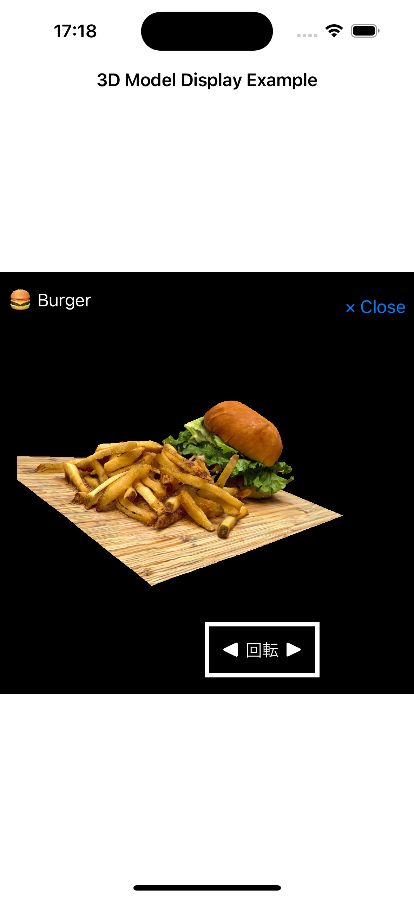

[ING] - AR1日体験ハッカソンでのサンプルリポジトリ

## 1. 概要

こちらは、5/19に株式会社メルカリ様にて開催された「[AR 1day Hackathon/お試し会](https://melting-hack.connpass.com/event/317845/)」で実装したサンプルになります。
基本的には`.scn`形式にした3Dモデルを画面内に表示し、SwiftUIを利用したUI関連実装とSceneKitを組み合わせたものになります。

__※注意:__ 

3Dモデルファイルが重かったので、`.scn`形式にした3Dモデルについては「Git LFS」を利用しています。

※ 直接DLする場合は「[こちら💁](https://www.dropbox.com/scl/fo/hacm1dj7om0w43qjjxt1i/ABj3u26s3sAKh99GXz_OBAM?rlkey=l8x01s2v999f1wlag23p6i1aw&st=9s884snh&dl=0)」

- 参考資料（about Git LFS）
  - https://zenn.dev/nakashi94/articles/23a598659a1815
  - https://qiita.com/dk-math/items/0828de3f3b214229baf7
  - https://support-ja.backlog.com/hc/ja/articles/360038329474-Git-LFS%E3%81%AE%E4%BD%BF%E7%94%A8%E6%96%B9%E6%B3%95

```shell
# すでに「Git LFS」を利用している場合は下記コマンドを実行してください。
$ git clone git@github.com:fumiyasac/ARDemoSample.git
$ git lfs pull
```

## 2. ポイント整理

__【🖼️ Screenshots】__

List | Detail
:--: | :--:
 | 

__【🎥 Movie】__

https://github.com/fumiyasac/ARDemoSample/assets/949561/1e3e48ea-53e2-408d-97a5-1c8c280c8753

__【🍀 Guidance】__


