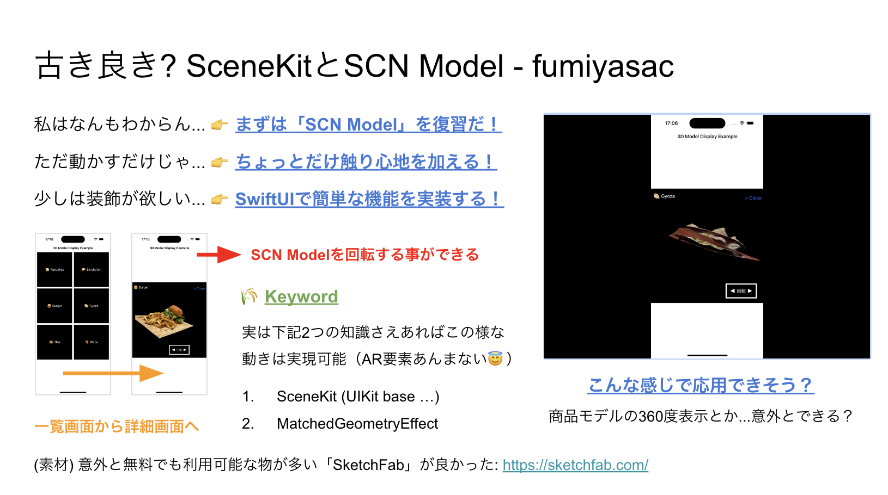

[ING] - AR1日体験ハッカソンでのサンプルリポジトリ

## 1. 概要

こちらは、5/19に株式会社メルカリ様にて開催された「[AR 1day Hackathon/お試し会](https://melting-hack.connpass.com/event/317845/)」で実装したサンプルになります。基本的には`.scn`形式にした3Dモデルを画面内に表示し、SwiftUIを利用したUI関連実装とSceneKitを組み合わせたものになります。

__(1)3DモデルとUI実装を組み合わせた解説動画:__ 

YouTubeチャンネル「kavsoft」様のサンプル実装動画も応用を考えていく上で参考になると思います。

- ① SwiftUI 2.0 SceneKit - SwiftUI Loading 3D Objects/Models Using SceneView - SwiftUI 2.0 Tutorials: 
  - https://www.youtube.com/watch?v=v8j121DiUfg
- ② SwiftUI 3.0 Pizza Animation Challenge - Complex Animations - Pizza App UI - Xcode: SwiftUI Tutorials:
  - https://www.youtube.com/watch?v=4fSwN48eSfU
- ③ SwiftUI 3D Shoe App UI - SceneKit - 3D Objects - Complex UI - Xcode 14 - SwiftUI Tutorials:
  - https://www.youtube.com/watch?v=d4ciSOLvIH8

__(2):3Dモデル表示をSceneKitを利用して実現する__ 

このサンプルでは、Xcodeで変換した.scn形式の3Dモデル表示部分SceneKitを利用しています。`UIViewRepresentable`を利用して`SCNView`のインスタンスをSwiftUIで表示する形を取っている点がポイントになります。

```swift
struct DetailCustomSceneView: UIViewRepresentable {

    // MARK: - `@Binding` Property

    @Binding var scene: SCNScene?

    // MARK: - Function

    func makeUIView(context: Context) -> SCNView {
        let view = SCNView()
        view.allowsCameraControl = false
        view.autoenablesDefaultLighting = true
        view.antialiasingMode = .multisampling2X
        view.scene = scene
        view.backgroundColor = .clear
        return view
    }

    func updateUIView(_ uiView: SCNView, context: Context) {}
}
```

3Dモデル表示と調整対応部分の実装例です。

```swift
// 👉 ① View要素内Property定義
// 表示対象SCNScene（SceneKit）をStateとして定義
@State private var scene: SCNScene?

// 👉 ② initializer内での調整処理
// SCNVector3: https://developer.apple.com/documentation/scenekit/scnvector3
// SCNVector4: https://developer.apple.com/documentation/scenekit/scnvector4
// (参考記事) https://appleengine.hatenablog.com/entry/2017/06/02/163647

// 処理1. 少しだけ手前側に斜めに倒すイメージにして見やすくする
self.scene?.rootNode.rotation = SCNVector4(
    1, // X軸
    0, // Y軸
    0, // Z軸
    0.1 * Float.pi // 角度（ラジアン）
)
// 処理2. 現在のサイズより1.28倍の拡大表示をする
self.scene?.rootNode.scale = SCNVector3Make(
    1.28, // X軸
    1.28, // Y軸
    1.28  // Z軸
)
```

SceneKitを利用した3Dモデル表示を回転可能にする部分の実装例です。

```swift
// 👉 ① スライダー要素のModifier処理部分の抜粋
.gesture(
    // DragGestureと連動して回転する様な形を実現する
    DragGesture()
       .updating($temporaryOffsetValue, body: { currentValue, outputValue, _ in
           // MEMO: -64.0をしているのは調整のため
           outputValue = currentValue.location.x - 64.0
       })
)
.onChange(of: temporaryOffsetValue) {
    // MEMO: 変数「offset」が変更されるので、配置要素が合わせて回転する
    rotateSceneViewObject(animate: temporaryOffsetValue == .zero)
}

// 👉 ② Drag処理変化量に合わせて水平方向回転を実施するメソッド
// ②-1: View要素のProperyにDragGesture発動時に一時的に格納するための変数が定義されている
@GestureState private var temporaryOffsetValue: CGFloat = 0

// ②-2: DragGesture発動時に一時的に格納するための変数
private func rotateSceneViewObject(animate: Bool = false) {

    // ① Transition処理を開始する
    if animate {
        SCNTransaction.begin()
        SCNTransaction.animationDuration = 0.36
    }

    // この様な条件分岐にしないと綺麗に回転しなかったんですよねー...😇
    scene?.rootNode.eulerAngles.y = Float((temporaryOffsetValue * .pi) / 180.0)

    // ② Transition処理を実行する
    if animate {
        SCNTransaction.commit()
    }
}
```

__(3):画面全体の構成__ 

一覧から詳細画面へ遷移する様に見せる構成において、ポイントになり得る部分をまとめています。

```swift
// 👉 ① View要素のProperyに表示対象EntityをStateとして定義
@State private var selectedMaterial: MaterialEntity? = nil

// 👉 ② body要素内ではZStackを利用して画面状態に合わせて表示対象の内容をAnimationを利用して切り替える
// ※ 「.matchedGeometryEffect」Modifierの活用して一意なID名と@Namespaceで定義する名前空間との紐付けを利用する
var body: some View {
    NavigationStack {
        // 全体をZStackにして表示要素を重ねている
        // 👉 AndroidやFlutter等でよく見る「Hero」Animationの様なイメージ
        ZStack {
            // `@State`で定義した変数の状態を元にして表示状態を決定する
            if selectedMaterial == nil {
                // 一覧表示時のView全体要素 (全体はScrollView + Grid表示構成)     
            } else {
                // 拡大時のView全体要素
            }
        }
        .frame(width: screenWidth)
        .navigationTitle("3Dモデルを表示して回転させよう♻️")
        .navigationBarTitleDisplayMode(.inline)
    }
}
```

__(4):3Dモデル入手する__ 

- https://developer.apple.com/jp/augmented-reality/quick-look/
- https://sketchfab.com/
  - 会員登録をすると、無料で提供されている3DモデルをDL可能です。

__※注意:__ 

3Dモデルファイルが重かったので、`.scn`形式にした3Dモデルについては「Git LFS」を利用しています。

※1. 直接DLする場合は「[こちら💁](https://www.dropbox.com/scl/fo/hacm1dj7om0w43qjjxt1i/ABj3u26s3sAKh99GXz_OBAM?rlkey=l8x01s2v999f1wlag23p6i1aw&st=9s884snh&dl=0)」

※2. Git LFSの導入に関しては、下記にピックアップした資料も参考にできるかと思います。

- 参考資料（about Git LFS）
  - https://zenn.dev/nakashi94/articles/23a598659a1815
  - https://qiita.com/dk-math/items/0828de3f3b214229baf7
  - https://support-ja.backlog.com/hc/ja/articles/360038329474-Git-LFS%E3%81%AE%E4%BD%BF%E7%94%A8%E6%96%B9%E6%B3%95

```shell
# すでに「Git LFS」を利用している場合は下記コマンドを実行してください。
$ git clone git@github.com:fumiyasac/ARDemoSample.git
$ git lfs pull
```

## 2. ポイント整理

__【📊 Presentation】__

5/21にWantedly株式会社様で開催された「Mobile勉強会 Wantedly × チームラボ × Sansan #14」でも、こちらの内容を登壇しております。

- [簡単なAR機能とUI実装を組み合わせてみた記録](https://speakerdeck.com/fumiyasac0921/jian-dan-naarji-neng-touishi-zhuang-wozu-mihe-wasetemitaji-lu)

__【🖼️ Screenshots】__

List | Detail
:--: | :--:
 | 

__【🎥 Movie】__

https://github.com/fumiyasac/ARDemoSample/assets/949561/1e3e48ea-53e2-408d-97a5-1c8c280c8753

__【🍀 Guidance】__


